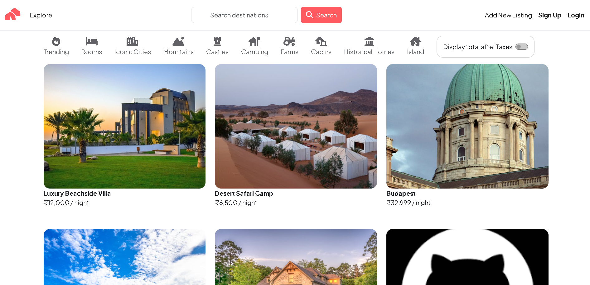

<!-- README -->
# NestHive 🏠



## About

NestHive is a modern accommodation booking platform that connects travelers with unique places to stay around the world. Inspired by platforms like Airbnb, NestHive allows users to browse listings, create accounts, post their own properties, and leave reviews.

## Key Features

- **User Authentication** - Secure signup/login system with passport.js
- **Property Listings** - Browse, filter, and search for accommodations
- **User Reviews** - Leave ratings and comments on properties
- **Property Management** - Create, edit, and delete your own listings
- **Image Upload** - Upload and store property images with Cloudinary
- **Responsive Design** - Mobile-friendly interface for all devices
- **Interactive Filters** - Filter properties by various categories
- **Flash Messages** - Informative user feedback for actions

## Tech Stack

### Backend
- Node.js
- Express.js
- MongoDB
- Mongoose
- Passport.js (Authentication)
- Cloudinary (Image Storage)
- Multer (File Handling)
- EJS (Templating)
- Express Session
- Connect-Flash
- Method-Override
- Joi (Validation)

### Frontend
- HTML5
- CSS3
- JavaScript
- Bootstrap 5
- Font Awesome
- EJS Templates

## Installation

Follow these steps to set up the project locally:

1. **Clone the repository**
   ```bash
   git clone https://github.com/onurags/nesthive.git
   cd nesthive
   ```

2. **Install dependencies**
   ```bash
   npm install
   ```

3. **Environment Variables**
   
   Create a `.env` file in the root directory with the following variables:
   ```
   ATLASDB_URL=your_mongodb_connection_string
   SECRET=your_session_secret
   CLOUD_NAME=your_cloudinary_cloud_name
   CLOUD_API_KEY=your_cloudinary_api_key
   CLOUD_API_SECRET=your_cloudinary_api_secret
   ```

4. **Database Setup**
   
   To initialize the database with sample data:
   ```bash
   node init/index.js
   ```

5. **Start the application**
   ```bash
   node app.js
   ```
   
   The application will be available at `http://localhost:8080`

## Usage Guide

### For Travelers

1. **Browse Listings**: Visit the homepage to see all available properties
2. **Filter Options**: Use the category filters at the top to narrow down your search
3. **View Details**: Click on any listing to see detailed information, photos, and reviews
4. **Create Account**: Sign up to access additional features
5. **Leave Reviews**: After logging in, you can leave ratings and reviews on properties

### For Property Owners

1. **Create Listing**: After logging in, click "Add New Listing" in the navigation bar
2. **Manage Properties**: Edit or delete your listings from the property detail page
3. **Upload Images**: Add high-quality images to showcase your property
4. **View Reviews**: See what guests are saying about your property

## Screenshots

### Home Page


### Property Details


### Add New Listing


## Contributing

Contributions are welcome! Here's how you can contribute to NestHive:

1. Fork the repository
2. Create a new branch (`git checkout -b feature/amazing-feature`)
3. Make your changes
4. Commit your changes (`git commit -m 'Add some amazing feature'`)
5. Push to the branch (`git push origin feature/amazing-feature`)
6. Open a Pull Request

Please ensure your code follows the project's coding standards and includes appropriate tests.

## Future Enhancements

- Implement search functionality
- Add payment processing
- Create a booking system
- Develop a messaging system between hosts and guests
- Add map integration for property locations
- Implement social media sharing

## License

This project is licensed under the MIT License - see the LICENSE file for details.

---

© 2025 NestHive Private Limited. All rights reserved.
